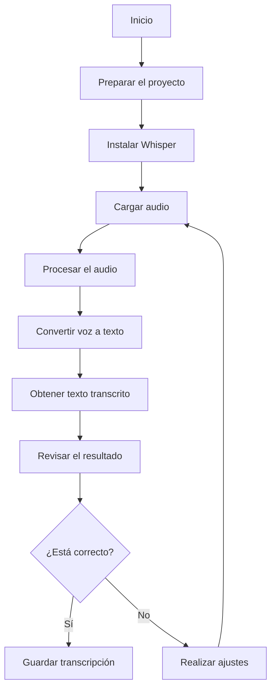

# Fernanda Narahi Rayas Flores

Rol en el proyecto: README y diagrama
- Desarrollo del modelo whisper de transcripción

```mermaid
flowchart TD
    A[Inicio] --> B[Preparar el proyecto]
    B --> C[Instalar Whisper]
    C --> D[Cargar audio]
    D --> E[Procesar el audio]
    E --> F[Convertir voz a texto]
    F --> G[Obtener texto transcrito]
    G --> H[Revisar el resultado]
    H --> I{¿Está correcto?}
    I -->|Sí| J[Guardar transcripción]
    I -->|No| K[Realizar ajustes]
    K --> D
```
