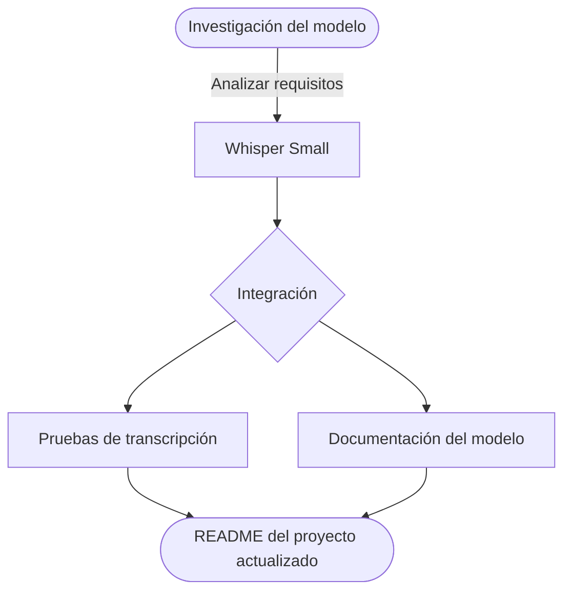

## Rol: Integración del modelo Whisper Small

```mermaid
flowchart TD
    A([Investigación del modelo]) -->|Analizar requisitos| B[Whisper Small]
    B --> C{Integración}
    C --> D[Pruebas de transcripción]
    C --> E[Documentación del modelo]
    D --> F([README del proyecto actualizado])
    E --> F
```
