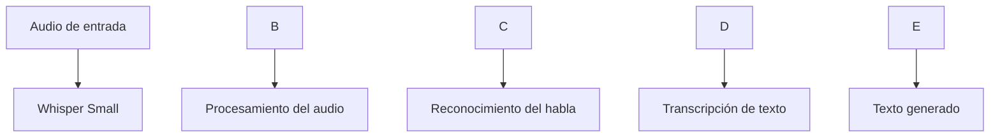

\#Paulina Ramírez

Rol en el proyecto :\[ Investiga como funciona el modelo de Transcripción "Whisper Small"]

Diagrama;

```mermaid

flowchart TD

A\[Audio de entrada] --> B\[Whisper Small]

B --> C\[Procesamiento del audio]

C --> D\[Reconocimiento del habla]

D --> E\[Transcripción de texto]

E --> F\[Texto generado]

```

&#x09;

